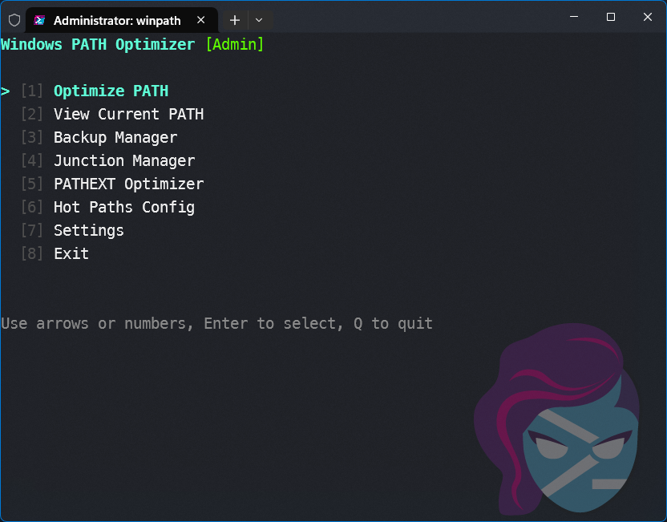
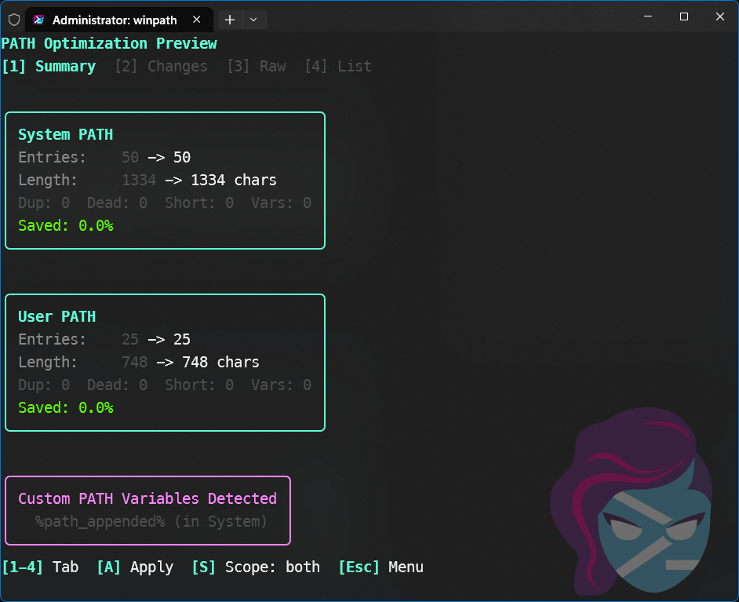
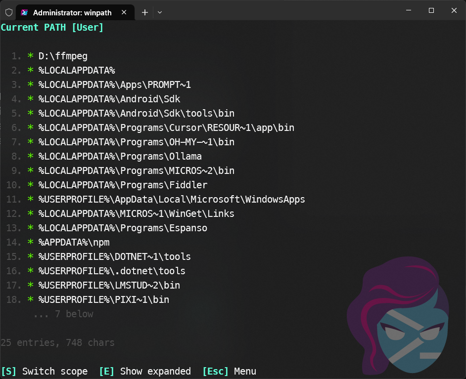
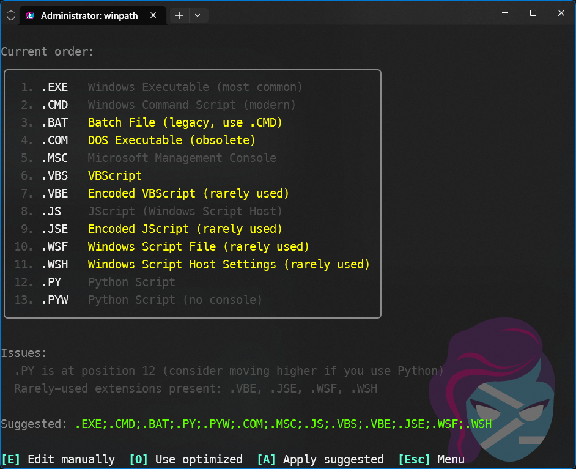

<div align="center">
  
  <h1>WinPath: Windows PATH Optimizer</h1>
  <p>
    <strong>A professional TUI for mastering your Windows Environment Variables.</strong>
  </p>

  <p>
    <a href="#features">Features</a> •
    <a href="#visual-walkthrough">Visual Walkthrough</a> •
    <a href="#installation">Installation</a> •
    <a href="#usage">Usage</a>
  </p>

  <p>
    
    
    
  </p>
</div>

<br />

## ⚡ Introduction

**WinPath** is a terminal-based utility designed to clean, organize, and optimize the Windows `PATH` environment variable.

Built with [Bubble Tea](https://github.com/charmbracelet/bubbletea), it solves the common "Path too long" errors and terminal lag by removing duplicates, cleaning dead links, and introducing modern optimization techniques like variable substitution and directory junctions.

---

## 📸 Visual Walkthrough

### 1. The Dashboard
The central hub for all optimization tools. Navigate effortlessly between the 7 core modules using a keyboard-driven interface.

<div align="center">
  
</div>

<br />

### 2. Optimize PATH
The core engine of WinPath. This module analyzes your System and User paths to:

* **Deduplicate:** Removes redundant entries instantly.
* **Clean:** Validates every path and removes "Dead" directories that no longer exist.
* **Shrink:** Automatically converts long paths to their 8.3 short filenames (e.g., `PROGRA~1`) or substitutes variables (e.g., `%USERPROFILE%`) to save space.

<div align="center">
  
  <p><em>(Placeholder: Take a screenshot of the 'Optimize PATH' diff screen)</em></p>
</div>

<br />

### 3. View Current PATH
Inspect your environment variables with precision.

* **Raw vs. Expanded:** Press `E` to toggle between variable names (`%APPDATA%`) and resolved paths (`C:\Users\Name\AppData\Roaming`).
* **Scope Switching:** Press `S` to instantly flip between **User** and **System** scopes.

<div align="center">
  
  <p><em>(Placeholder: Take a screenshot of 'View Current PATH')</em></p>
</div>

<br />

### 4. Backup Manager
Safety first. WinPath automatically creates a JSON snapshot of your environment before every modification.

* **Restore:** Rollback to any previous state with one keypress.
* **History:** View timestamps and filenames for all saved states.

<div align="center">
  
  <p><em>(Placeholder: Take a screenshot of 'Backup Manager')</em></p>
</div>

<br />

### 5. Junction Manager
A unique tool for power users hitting the 1024-character limit.

* **Suggestions:** Scans your PATH for long, repetitive folders and suggests candidates for shortening.
* **Action:** Creates a directory Junction (Symlink), mapping a short path (e.g., `C:\l\go`) to a long target, saving precious characters in your string.

<div align="center">
  
  <p><em>(Placeholder: Take a screenshot of 'Junction Manager')</em></p>
</div>

<br />

### 6. PATHEXT Optimizer
Speed up your command line execution. Windows checks file extensions in order every time you type a command.

* **Reorder:** Moves modern extensions (`.EXE`, `.CMD`) to the top and legacy ones (`.COM`) to the bottom.
* **Bloat Removal:** Identifies rarely used extensions (`.WSF`, `.JSE`) that slow down lookups.

<div align="center">
  
  <p><em>(Placeholder: Take a screenshot of 'PATHEXT Optimizer')</em></p>
</div>

<br />

### 7. Hot Paths & Settings

* **Hot Paths:** Define high-priority tools that should always appear at the *front* of your PATH to ensure they override other versions.
* **Settings:** Configure maximum backup retention, auto-backup toggles, and your preferred Junction folder location.

---

## 🛠️ Installation

### Prerequisites

* Windows 10/11
* Go 1.21+ (if building from source)

### Build from Source

```powershell
# Clone the repository
git clone https://github.com/quantumJLBass/winpath.git
cd winpath

# Build optimized binary
./build.ps1

```

*The build script generates `WinPath.exe` in the root directory.*

#### To run with out building

```powershell
# install
go mod tidy

# Run with out building
go run  .
```

---

## 🎮 Usage

Run as Administrator to enable System-level changes.

```powershell
Start-Process -Verb RunAs .\WinPath.exe
```

### Keyboard Shortcuts

| Key | Action |
| --- | --- |
| `↑` / `↓` | Navigate Menu / Scroll Lists |
| `Enter` | Select / Confirm |
| `1` - `8` | Quick Jump to Menu Item |
| `S` | Switch Scope (User / System) |
| `A` | Apply Changes |
| `C` | Copy to Clipboard / Create |
| `Esc` / `Q` | Back / Quit |

---

## ⚙️ Configuration

WinPath stores its configuration and backups in your user profile:

* **Config File:** `%USERPROFILE%\.syspath\config.json`
* **Backups:** `%USERPROFILE%\.syspath\backups\`

You can customize the **Max Backups** count and **Junction Folder** location directly inside the app's Settings menu.

## 🤝 Contributing

Contributions are welcome! Please ensure any Pull Requests include updates to the relevant documentation and tests.

## 📄 License

MIT License © 2026 Quantum
